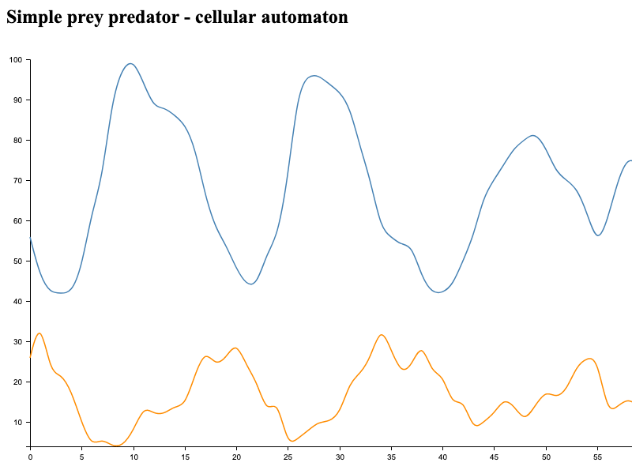

# Prey Predator - cellular automaton

"Prey Predator" is a simple cellular simulation of ecosystem, where predators eat their preys.

The first implementation, in Ruby language, was prepared during my Bachelor studies of Computer Science. This source code was the base for  my concluding about game rules. 
Also it states for me as a some kind of a lesson about my professional development. It also remind me my very beginnings of programming, my doubts, uncertainty and mistakes.

# Rules

There are two species, preys (sheep) and predators (wolfs), propagated randomly on the two-dimension board. Each cell on the board can be settle by up to two individuals.
The next phase after settling is checking a live conditions. The rules are following:

* one sheep produce one additional sheep in the next iteration
* one or two predators in the cell die
* one sheep and one predator produce one additional predator and the prey dies.

The last but not least step is counting number of produced individuals and go to the first step, propagating the board using new numbers.

# Goal

The main goal of this algorithm is simulating the ecosystem inhabited by preys and predators. Though above rules are very primitive, there is a possibility to observe "Lotka–Volterra equations".

<div style="text-align:center"></div>

# Usage

```zsh
# JavaScript (Node)
cd js && yarn && yarn build && yarn serve
```

# What next

The next, more interesting game could be [Wator: A Predator-Prey simulation](https://beltoforion.de/article.php?a=wator_simulation&s=idPageTop).


## Resources

1. https://en.wikipedia.org/wiki/Cellular_automaton
1. https://en.wikipedia.org/wiki/Lotka%E2%80%93Volterra_equations